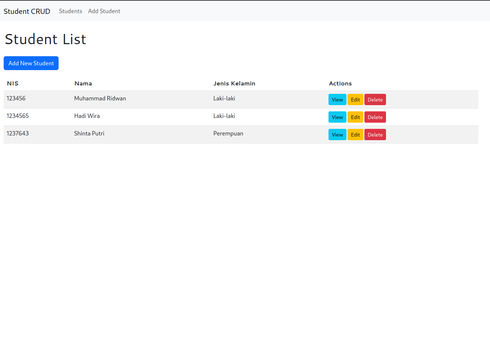
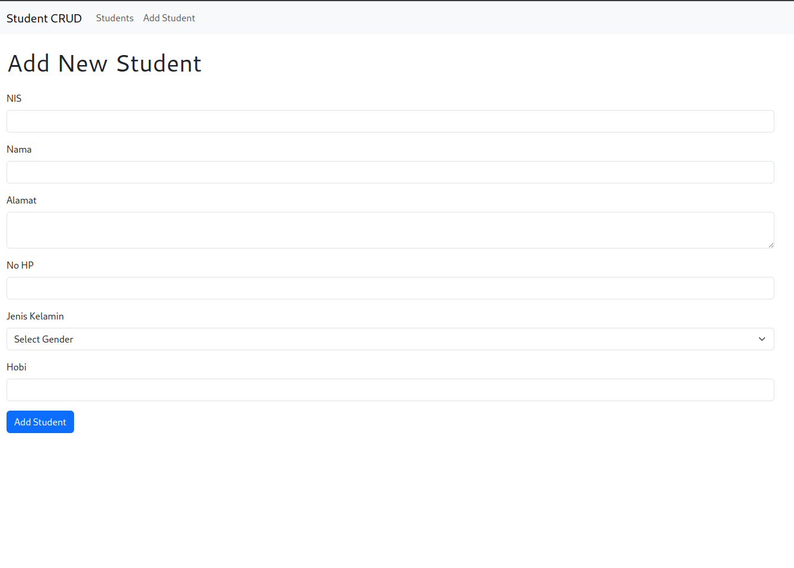
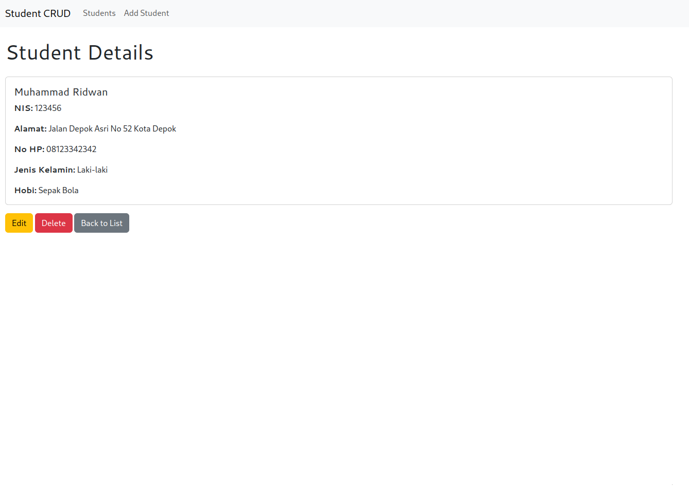
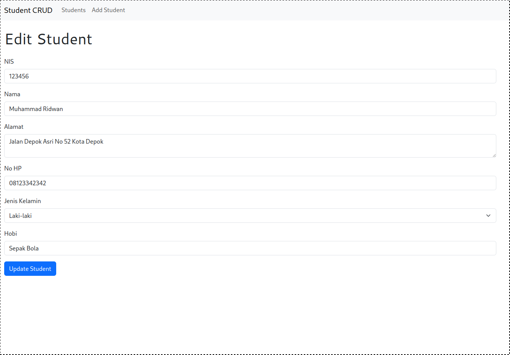
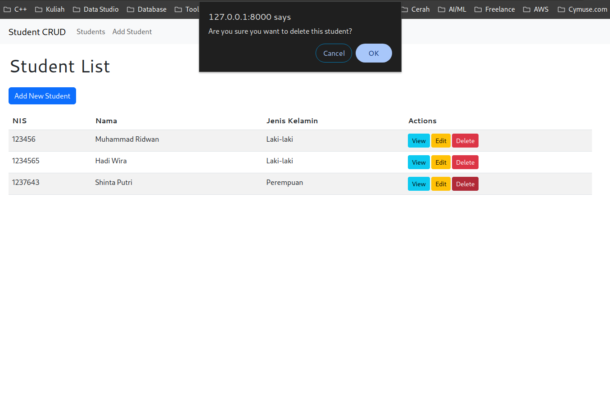

# Student CRUD Application

This is a Laravel-based CRUD (Create, Read, Update, Delete) application for managing student information. The application allows users to perform basic operations on student records, including adding new students, viewing student details, updating student information, and deleting student records.

## Features

- List all students
- Add a new student
- View student details
- Edit student information
- Delete a student
- Dockerized for easy deployment

## Requirements

- PHP 8.1+
- Composer
- MySQL
- Docker (optional, for containerized deployment)

## Installation

1. Clone the repository:
   ```
   git clone https://github.com/emaranalytics/student-crud.git
   cd student-crud
   ```

2. Install dependencies:
   ```
   composer install
   ```

3. Copy the `.env.example` file to `.env` and configure your database settings:
   ```
   cp .env.example .env
   ```

4. Generate application key:
   ```
   php artisan key:generate
   ```

5. Run migrations:
   ```
   php artisan migrate
   ```

## Usage

1. Start the development server:
   ```
   php artisan serve
   ```

2. Access the application in your web browser at `http://localhost:8000`

3. Use the interface to manage student records:
   - View all students on the home page
   - Click "Add New Student" to create a new student record
   - Click on a student's name to view their details
   - Use the "Edit" button to update student information
   - Use the "Delete" button to remove a student record

## Docker Deployment

This project includes a Dockerfile for easy containerization. To deploy using Docker:

1. Build the Docker image:
   ```
   docker build -t student-crud .
   ```

2. Run the container:
   ```
   docker run -p 8080:80 student-crud
   ```

3. Access the application at `http://localhost:8080`

## Contributing

Contributions are welcome! Please feel free to submit a Pull Request.

## License

This project is open-sourced software licensed under the [MIT license](https://opensource.org/licenses/MIT).

## Screenshots

### List of Students


### Add New Student


### View Student Details


### Edit Student Information


### Delete Student

